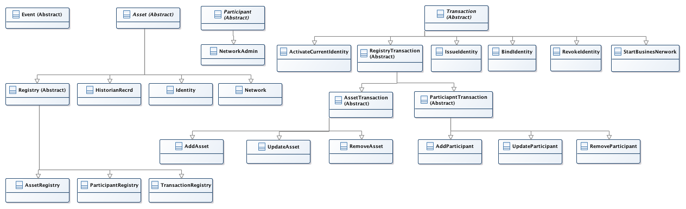

### [TOC](./TOC.md)

#ACls

## resources in system.cto

| resource | comments |
| -------- | -------- |
| Asset | Any type of asset|
| Participant | Any type of participant|
| Transaction | Any type of transaction|
| Event | Any type of Event |
| Registry | Any type of registry |
| AssetRegistry | Any type of Asset Registry registry, will create an AssetRegistry registry and it will hold a list of all the Asset Types in both system and Business network|
| ParticipantRegistry | Any type of Participant Registry registry, will create a ParticipantRegistry registry and it will hold a list of all the Participant Types in both system and Business network|
| TransactionRegistry | Any type of Transaction Registry registry, will create a TransactionRegistry regsitry and it will hold a list of all the Transaction Types in both system and Business network|
| Network | type of Asset that represents a business network will also have a Network registry to hold instances |
| NetworkAdmin | type of Participant, will also have a NetworkAdmin registry to hold instances|
| HistorianRecord | type of Asset , will also have a HistorianRecord registry to hold instances|
| RegistryTransaction | type of Transaction class |
| AssetTransaction | type of Registry Transaction |
| ParticipantTransaction | type of Registry Transaction |
| AddAsset | type of transaction, will also have a transaction registry to hold instances of it |
| UpdateAsset | type of transaction, will also have a transaction registry to hold instances of it |
| RemoveAsset | type of transaction, will also have a transaction registry to hold instances of it |
| AddParticipant | type of transaction, will also have a transaction registry to hold instances of it |
| UpdateParticipant | type of transaction, will also have a transaction registry to hold instances of it |
| RemoveParticipant | type of transaction, will also have a transaction registry to hold instances of it |
| Identity | type of Asset will have a registry to hold instances of |
| IssueIdentity | type of transaction, will also have a transaction registry to hold instances of it |
| BindIdentity | type of transaction, will also have a transaction registry to hold instances of it |
| ActivateCurrentIdentity | type of transaction, will also have a transaction registry to hold instances of it |
| RevokeIdentity | type of transaction, will also have a transaction registry to hold instances of it |
| StartBusinessNetwork | type of transaction, will also have a transaction registry to hold instances of it |
| ResetBusinessNetwork | type of transaction, will also have a transaction registry to hold instances of it |
| SetLogLevel | type of transaction, will also have a transaction registry to hold instances of it |

## Rules that everyone should have

| resource | operation | description        |
| -------- | --------- | ------------       |
| Network | READ | Everyone must have read access to the business network |
| AssetRegistry#HistorianRecord | READ | Everyone who will manipulate an asset, participant or submit a transaction will need to be able to read the Historian Asset Registry. |
| HistorianRecord | CREATE | Everyone who will manipulate an asset, participant or submit a transaction will need to be able to create a Historian Record |
| ParticipantRegistry | READ | Need this to see all the participant registries |
| TransactionRegistry#AddParticipant | READ | Allows you to read the registry for system transactions, you need this to be able to get the system transaction you want to create |
| AddParticipant | CREATE, READ | Allows you to create the AddParticipant transaction object, read access so you can see it in historian |
| Participant | CREATE, READ | Allows you to create any (system or otherwise) type of Participant Type, and then be able to see that it was created |
| TransactionRegistry#UpdateParticipant | READ | |
| UpdateParticipant | CREATE, READ | Allows you to create and read later in historian the UpdateParticipant transaction object |
| Participant | CREATE, READ, UPDATE | Allows you to create any (system or otherwise) Participant Type, and then be able to see that it was created and then update the participant |
| AssetRegistry#Identity | READ | Ability to view the identity registry |
| Identity | CREATE, READ | Read is required to read the list of identities, CREATE is required to create a new Identity asset |
| TransactionRegistry#IssueIdentity | READ | Need to be able to read the system transaction IssueIdentity |
| IssueIdentity | CREATE, READ | Need to be able to create the system transaction IssueIdentity, read so that can view historian record |

