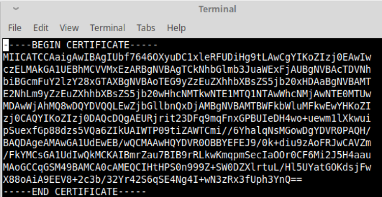

### [TOC](./TOC.md)
### [Back - Managing Id's and Participants](./managingids.md)


# Handling Certificate Renewal
A lot of the information in this section has been repeated elsewhere, but given the importance of this topic, the information here is presented in it's completeness and doesn't need to refer to other sections.

## Introduction
Composer relies on the X509 certificate system for access first to the fabric network and then to the business network itself. X509 certificates have an expiration date therefore Composer applications including the Composer business network as well need to have a process in place to ensure that users, and this includes any defined administrator type users, are not locked out of the application/business network.
In fact there is the potential that if all users’ certificates expire then you will be locked out of the business network completely with no way to recover.
For this reason it is imperative to have a process in place to at least renew your admin certificates (the ones that have been given permission to perform identity management in your ACLs) before they expire, this ensures that if other certificates expire (such as those issued to end users) you still have the ability to get new cards with new identities to these users using your admin cards.

## How Composer handles certificates
Aside from how fabric itself handles certificates, Composer maintains a registry of all certificates (and an identifier generated from the public key of that certificate) that are mapped to participants. This is how Composer is able to associate a specific participant when requests come from a client connection. The client connects using a card and that card contains the identity (private key/public certificate) and it’s by using the certificate of that identity and generating an identifier from it, it is able find the participant that certificate should map to. 
If a certificate is about to expire then you would want to ensure that any new certificate generated was added to this registry and mapped to the same participant and you would also want to update your card store so that the card now has this new certificate.

## How Composer Manages this registry of certificates
Composer adds new identity mappings to this registry when the following commands are used
1.	composer network start
2.	composer identity issue
3.	composer identity bind

Special handling is in place for when a secret is used in the composer network start (-S option) and composer identity issue as no enrollment has actually taken place yet so there is no certificate.

## Determining when an identity in a card needs to be updated
There is nothing in Hyperledger Composer that quickly helps you identify when an identity in a card is about to expire. As part of your operational processes you may have tracked when card files were created this won’t give you the exact date/time when the will expire as it is dependent on when the user was actually enrolled with the CA. If the card file was a one-time use only card file, then the exact date will be when that card file was imported into the card store and used for the first time (eg a composer network ping). If the card was built from a private key/public certificate then it depends on when you performed the enrollment yourself (either by using composer identity request or fabric-ca-client enroll)
There are 2 ways you can determine if the identity in a card is about to expire. The first being quicker but will be more problematic if participants have multiple certificates associated with them (ie multiple cards with different identities map to the same participant) and then it is a case of finding the right card that contains that specific identity. If there is a one to one mapping then it’s simpler.
**IMPORTANT: There is no way to check cards that have been imported into the Composer Rest Server that is configured for multi-user mode.**

### Method 1: Using composer identity list
The composer identity list command outputs the contents of the identity registry. However it does not include any information about when the certificate will expire and unless explicitly revoked that entry will always have a state of ACTIVATED even if the certificate has expired. If the certificate is revoked then it’s state will be REVOKED.
An entry in this output can also have 2 other states. BOUND means the certificate has been registered but that identity has not been used yet (ie no client has used a card containing that identity yet). ISSUED means that a card has been issued with a secret but the user has not yet been enrolled and thus the certificate will not have been registered yet. 
The entries you will be interested in are ones which have a certificate field and have the state BOUND or ACTIVATED.
The output from composer identity list for an individual entry looks like this

```
$class:      org.hyperledger.composer.system.Identity
 identityId:  2196bdc77c24cb52f0979a114daa5d75a52300e1a38ca8905a189607e4a452a0
 name:        admin
 issuer:      ac3dbcbe135ba48b29f97665bb103f8260c38d3872473e584314392797c595f3
 certificate: 
   """
     -----BEGIN CERTIFICATE-----
     MIICATCCAaigAwIBAgIUbf7646OXyuDC1xleRFUDiHg9tLAwCgYIKoZIzj0EAwIw
     czELMAkGA1UEBhMCVVMxEzARBgNVBAgTCkNhbGlmb3JuaWExFjAUBgNVBAcTDVNh
     biBGcmFuY2lzY28xGTAXBgNVBAoTEG9yZzEuZXhhbXBsZS5jb20xHDAaBgNVBAMT
     E2NhLm9yZzEuZXhhbXBsZS5jb20wHhcNMTkwNTE1MTQ1NTAwWhcNMjAwNTE0MTUw
     MDAwWjAhMQ8wDQYDVQQLEwZjbGllbnQxDjAMBgNVBAMTBWFkbWluMFkwEwYHKoZI
     zj0CAQYIKoZIzj0DAQcDQgAEURjrit23DFq9mqFnxGPBUIeDH4wo+uewm1lXkwui
     pSuexfGp88dzs5VQa6ZIkUAIWTP09tiZAWTCmi//6YhalqNsMGowDgYDVR0PAQH/
     BAQDAgeAMAwGA1UdEwEB/wQCMAAwHQYDVR0OBBYEFEJ9/0k+diu9zAoFRJwCAVZm
     /FkYMCsGA1UdIwQkMCKAIBmrZau7BIB9rRLkwKmqpmSecIaOOr0CF6Mi2J5H4aau
     MAoGCCqGSM49BAMCA0cAMEQCIHtHPS0n999Z+SW0DZXlrtuL/Hl5UYatGOKdsjFw
     X88oAiA9EEV8+2c3b/32Yr42S6qSE4Ng4I+wN3zRx3fUph3YnQ==
     -----END CERTIFICATE-----
     
   """
 state:       ACTIVATED
 participant: resource:org.hyperledger.composer.system.NetworkAdmin#admin
```
From here I can see there is only 1 certificate so I know there is going to be 1 card in each card store (if you have multiple card stores) that this is referred to and the card is likely to be called admin@(business network name), eg admin@basic-sample-network
You need to take that certificate paste it into an online certificate decoder such as https://www.sslshopper.com/certificate-decoder.html


Alternatively you could copy the text to a file eg certificate.crt (you must remove all leading and trailing spaces of each line) and use the openssl command (if have openssl installed on your system). 



```
openssl x509 -in certificate.crt -text -noout
Certificate:
    Data:
        Version: 3 (0x2)
        Serial Number:
            6d:fe:fa:e3:a3:97:ca:e0:c2:d7:19:5e:44:55:03:88:78:3d:b4:b0
    Signature Algorithm: ecdsa-with-SHA256
        Issuer: C = US, ST = California, L = San Francisco, O = org1.example.com, CN = ca.org1.example.com
        Validity
            Not Before: May 15 14:55:00 2019 GMT
            Not After : May 14 15:00:00 2020 GMT
...
```
### Method 2: Checking each card in each card store
This does not include the Composer Rest Server card store such as MongoDB if you have used the Composer Rest Server in Multi-user mode.
Given that Cloud Wallets persist the card store in places other than the local file system, these steps will work for all wallet types. It won’t cover looking directly on the file system when using the local file system wallet implementation
1.	Get a list of all the cards in the card store using composer card list -q. This gives just a list of the cards
2.	You need to export each card into a card file For example composer card export -c admin@basic-sample-network
3.	Change the file extension from `.card` to `.zip` to make it easy to unzip file file and unzip it.
4.	In the credentials directory is the certificate file. You can either paste the contents into an online too such as https://www.sslshopper.com/certificate-decoder.html or you can decode directly using the openssl command with openssl x509 -in certificate -text -noout

## How to create a new card file with a new identity
In composer there were multiple ways to get identities and to register users in a fabric CA. There were the standard ways such as 
- composer identity request
- composer network start
- composer identity issue
  
Playground could also be used to do this as well, however it basically used composer identity issue under the covers
But of course there was also the fabric-ca-client that could be used to register users to the ca server and to enroll those users (fabric-ca-client used the term identity, whereas composer used the term users).
Renewing the fabric network admin card
The Fabric network admin card is the card that is used to perform fabric level administrative actions such as installing a business network, starting or upgrading business networks. In the composer tutorials it was generally referred to as PeerAdmin (which was technically incorrect and should have been called FabricAdmin).
If you need to renew this card, you should obtain the appropriate certificate and private key which has authority to install chaincode and do channel admin capabilities and use the `composer card create` command to create the new card. Ensure you export the old card just in case and delete it. For example
- Composer card create –p (your fabric network profile) -u fabricadmin -c (public cert .pem file) -k (private key .pem file) -f fabricadmin.card
- Composer card import -f fabricadmin.card -n fabricadmin

Now you can say install a new version of a business network as follows
Composer network install –c fabricadmin -a newbusinessnetwork.bna

### Renewing the business network admin card
A lot of composer users re-used the bootstrap user of the fabric-ca-server which was called admin and depending on your setup of the ca-server being used, might have had a password of adminpw. 
Composer users were most likely to reuse this user within the composer start command to start their business network and it become the initial identity that was bound to NetworkAdmin#admin and most composer users will have made this participant the business network administrator, so for example 
```
composer network start -n basic-sample-network -V 0.2.6 -c PeerAdmin@hlfv1 -A admin -S adminpw
```
But could have also re-used it for other participants. The following instructions describe how to renew this identity for the NetworkAdmin#admin participant and it is assumed that you used the ca-server admin user for this such that your business network admin user is also your fabric-ca admin user. It is highly recommended you have a backup admin for your business network in case you make a mistake. This process could also be applied (adapted by changing the names as appropraite) to other cards that were not created using composer identity issue but were done using fabric-ca-client to register users.
- Determine the identifier of the current admin card

`Composer network ping –c admin@(name of your business network)`
The output will be something like
```
The connection to the network was successfully tested: basic-sample-network
    Business network version: 0.2.6
    Composer runtime version: 0.20.8
    participant: org.hyperledger.composer.system.NetworkAdmin#admin
    identity: org.hyperledger.composer.system.Identity#2196bdc77c24cb52f0979a114daa5d75a52300e1a38ca8905a189607e4a452a0
```
The identifier is the text following the `org.hyperledger.composer.system.Identity#` and in the above example would be `2196bdc77c24cb52f0979a114daa5d75a52300e1a38ca8905a189607e4a452a0`.
- Make a new directory to store the new admin identity
`mkdir newadmin`
- Use the composer identity request command to enroll admin again
`composer identity request -c admin@(name of your business network) -u admin -s (your admin secret) -d newadmin`
- Change to the newadmin directory
`cd newadmin`
- Bind the new identity to the NetworkAdmin#admin participant
`composer identity bind -c admin@(name of your business network) -a org.hyperledger.composer.system.NetworkAdmin#admin -e admin-pub.pem`
- Export the current admin card to a card file (just in case)
`composer card export –c admin@(name of your business network) -f oldadmin.card`
- Create a new admin card file with the new admin pem files (unless you use composer-playground which is not recommended for anything except simple development you don’t need the -r PeerAdmin -r ChannelAdmin options on the composer card create command). As this card doesn’t contain a secret it is shareable
`composer card create -p (your fabric network connection profile) -u admin -c admin-pub.pem -k admin-priv.pem -n (name of your business network) -f newadmin.card`
- Delete the existing admin card from the card store
`composer card delete -c admin@(name of your business network)`
- Import the new admin card into your card store
`composer card import -f newadmin.card`
- Confirm the new card is working and correct by checking the output from a ping command is the same as before EXCEPT that the identifier has changed
`composer network ping -c admin@(name of your business network)`
- (OPTIONAL) you can revoke the old identifier if you wish, but you don’t have to as once the certificate expires it won’t be able to access the business network. You might want to consider revoking it so that you know which certificates are really active if you do a composer identity list. Composer doesn’t check expiration dates of a certificate so unless revoked an expired certificate will always be listed as ACTIVATED when doing a composer identity list. To revoke
`composer identity revoke -c admin@(name of your business network) -u (THE OLD IDENTIFIER)`
***WARNING: Composer doesn’t stop you from revoking yourself, make sure you use the old identitier otherwise you will revoke your own admin access. If you do, restore your saved old admin card and start again.***

### Renewing cards created using composer identity issue
Unfortunately cards created using composer identity issue registered users in the fabric-ca-server with a maximum number of enrollments set to 1. This means that you cannot enroll this user again, you can only re-enroll it. Composer did not provide a re-enroll capability. There are possible ways round this listed next, but no details about this will be provided. 
1.	You could delete the registered user (identity in fabric-ca terms) using the fabric-ca-client CLI  using the fabric-ca-client CLI however unless your fabric-ca-server has explicitly enabled this (the default of a ca-server was to disable this feature) and most likely this will not be possible in your environment
2.	You could use the fabric-ca-client to re-enroll the user, but to do this would require you to set up the correct directory structure loaded with the certificate and private key from the card you are trying to renew, then use the fabric-ca-client to re-enroll to get a new certificate and private key.
3.	You could try to alter the max-enrollments of the current registered user using the fabric-ca-client command.

The above are all complex scenarios requiring far more indepth knowledge of hyperledger fabric itself and so are not covered.

The simplest solution is to issue a new identity for the user using the composer identity issue command. You can still bind it to the same participant as before and you can even import the card into the card store as the name of the original card (so long as you have deleted the original one of course)  but you will have to specify a new user name.
For the purposes of the following example to demonstrate, Lets assume the user is called `alice` and and they are bound to a participant `org.myexample.trader#alice`
- (OPTIONAL) Determine the identifier of the current user card (if you plan to revoke the old identity)
`Composer network ping –c aalive@(your business network)`
The output will be something like
```
The connection to the network was successfully tested: basic-sample-network
    Business network version: 0.2.6
    Composer runtime version: 0.20.8
    participant: org.myexample.trader#alice
    identity: org.hyperledger.composer.system.Identity#2196bdc77c24cb52f0979a114daa5d75a52300e1a38ca8905a189607e4a452a0
```
The identifier is the text following the `org.myexample.trader#` and in the above example would be `2196bdc77c24cb52f0979a114daa5d75a52300e1a38ca8905a189607e4a452a0`.
- Backup the current card from the card store (just in case)
`composer card export -c alice@(business network name) -f olduser.card`
- Issue a new identity (if you don’t specify the -o affiliation= option, it will default to org1 affiliation)
`composer identity issue -c admin@(business network name) -u alice2 -a org.myexample.trader#alice -o affiliation=(your fabric ca affiliation)`
- Delete the old card
`composer card delete -c alice@(your business network name)`
- Import the new card as the same name
`composer card import -f alice2@(business network name).card -c alice@(business network name)`
- ping the card
`composer card ping -c alice@(business network name)`
- Delete the old card file as it is a single use only card
`rm alice2@(business network name).card`

I would also consider exporting this card to keep a copy of the new active card.
OPTIONAL: you can revoke the identity that is about to expire if you wish to know which identities in the composer business network registry are actually valid when doing a composer identity list. You would use the `composer identity revoke -u (identifier of the old card)`
