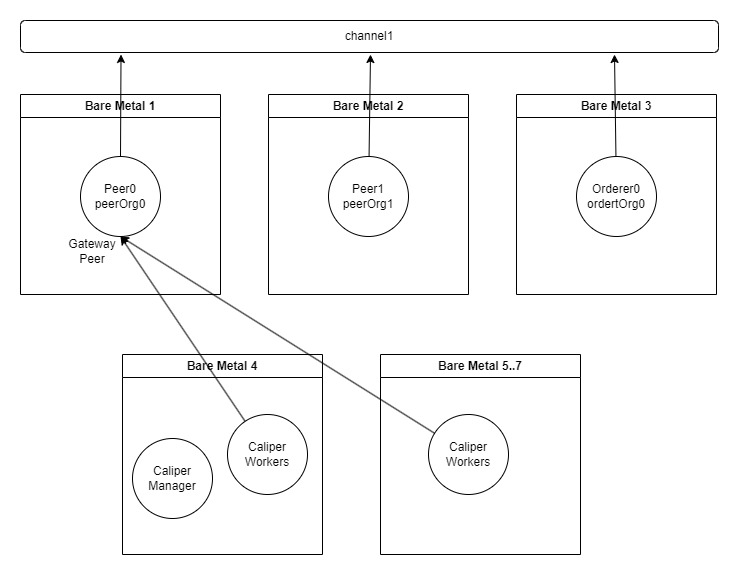

# Fabric Performance

Hyperledger Fabric performance is a question that comes up frequently as users try to compare it to transactional databases or other blockchain platforms in terms of the maximum TPS (Transactions Per Second). Performance in a Hyperledger Fabric network is complex because in an appropriately deployed network there will be many organisations participating, each with their own hardware and networking infrastructure, along with different solution characteristics such as number of channels, chaincode implementations and policies.

Fabric 2.x has performance improvements over Fabric 1.4. Fabric 1.4 is now out of LTS and should not be used in production environments. As Fabric 2.5 is the latest LTS version and includes the new peer Gateway service. When used with the new gateway SDKs, applications will demonstrate improved performance relative to applications based on the legacy SDKs.

Hyperledger Fabric documentation now has a section on [Performance Considerations](https://hyperledger-fabric.readthedocs.io/en/release-2.5/performance.html) which can be found in the 2.5 and latest versions of the Hyperledger fabric documentation. This provides useful insight into helping to achieve a performant Fabric network. It doesn't include information about certain scalability concerns such as large numbers of PDCS, channels, organisations etc.

## Performance benchmarks

The following describes some initial performance benchmarks done on Hyperledger Fabric 2.5 builds to give an example transactions per second (TPS) that was achieved, based on a very specific chaincode running on dedicated hardware.

### Hardware and Topology

The Fabric topology used was 2 peer Organisations (PeerOrg0, PeerOrg1) with a single peer node in each and 1 Ordering Service Organisation (OrdererOrg0) with a single orderer service node configured for Raft. TLS was enabled for each node.

Each node had the same identical hardware

- Intel(R) Xeon(R) Silver 4210 CPU @ 2.20GHz
- 40 Cores made up of 2 CPUs. Each CPU has 10 physical cores supporting 20 Threads in total
- 64Gb Samsung 2933Mhx Memory
- MegaRAID Tri-Mode SAS3516 (MR9461-16i) disk controller
- Intel 730 and DC S35x0/3610/3700 Series SSD attached to disk controller
- Ethernet Controller X710/X557-AT 10GBASE-T
- Ubuntu 20.04

The machines were all on the same switch.

Hyperledger Fabric was deployed natively to 3 physical machines (ie the native binaries were installed and executed, no container technology such as Docker or Kubernetes was used).

### Fabric Application Configuration

- LevelDB was used for the state database
- Gateway Service Concurrency limit was set to 20,000
- A single application channel was created and the 2 peers and orderer were joined to this channel
  - The application capabilities were set to V1_4 so as to use the old lifecycle deployment. All other capabilities were set to V2_0 (capability level should not impact performance).
- No system channel exists only the application channel
- Go chaincode without the Contract API was deployed (fixed-asset-base from hyperledger Caliper-Benchmarks)
- Endorsement policy 1 Of Any was specified for the chaincode
- No private data was used
- Default Fabric policies and configurations (note that in 2.5 SendBufferSize now defaults to 100) excluding anything previously mentioned
- No range queries or JSON queries
- The network was enabled for TLS, but not mutual TLS

### Load Generator

Hyperledger Caliper 0.5.0 was used as the load generator and for the report output. Caliper was bound to `Fabric:2.4` which means it used the peer Gateway Service to invoke and evaluate transactions. All transactions were generated from the same organisation to it's gateway peer.

The load itself was defined from fixed-asset in Hyperledger Caliper-Benchmarks.

Caliper used 4 bare metal machines to host remote caliper workers and also to host a single caliper manager to generate the load on the Hyperledger Fabric Network. In order to generate enough workload on the fabric network we have to use multiple caliper workers which equate to the number of current clients connecting to the network. In the results section, the number of caliper workers is provided.

### Diagram of overall Topology



### Results

These results were generated against the latest builds of Hyperledger Fabric 2.5 and utilised the [default node and channel config values](https://github.com/hyperledger/fabric/tree/release-2.5/sampleconfig). Specifically the following block cutting parameters were used:

- block_cut_time: 2s
- block_size: 500
- preferred_max_bytes: 2Mb

In order to be able to push enough workload through without hitting concurrency limits, the gateway concurrency limit was set to 20,000.

In summary the following benchmarks are presented here:

- Blind write of a single key with 100 Byte Asset Size (a create asset benchmark)
- Blind write of a single key with 1000 Byte Asset Size (a create asset benchmark)
- Read/Write of a single key with 100 Byte Asset Size (an update asset benchmark)
- Read/Write of a single key with 1000 Byte Asset Size (an update asset benchmark)

The following should also be noted

- Only a single channel is used and thus the peer doesn't utilise it's full resources (as described earlier a peer can achieve more throughput if more than one channel is utlised).
- The chaincode is optimised for these tests. Real world chaincode will not be as performant.
- The caliper workload generator is also optimised for pushing transactions. Real world applications will also have a client implementation generating the workload which will introduce some latency.
- The caliper workload generator is sending transactions to a single gateway peer on the same organisation. Real world applications are likely to have multiple organisations sending transactions concurrently. There is the potential for higher TPS results if the workload is sent to from multiple organisations rather than just the same organisation.
- Utilising the gateway service means that blocks are not received by the client (caliper) via the delivery service to determine whether a transaction has completed, improving the performance of the client and the network compared to using the legacy node SDK.

#### Blind Write of a single key 100 Byte Asset Size

A Blind write is a transaction that performs a single write to a key regardless of whether that key exists and contains data. This is a `Create Asset` type of scenario.

Caliper test configuration:

- workers: 200
- fixed-tps, tps: 3000

```bash
+------------------+--------+------+-----------------+-----------------+-----------------+-----------------+------------------+
| Name             | Succ   | Fail | Send Rate (TPS) | Max Latency (s) | Min Latency (s) | Avg Latency (s) | Throughput (TPS) |
|------------------|--------|------|-----------------|-----------------|-----------------|-----------------|------------------|
| create-asset-100 | 360200 | 0    | 2995.0          | 2.13            | 0.18            | 0.33            | 2946.7           |
+------------------+--------+------+-----------------+-----------------+-----------------+-----------------+------------------+
```

The TPS here is the peak. Trying to push beyond this resulted in unexpected failures and a drop in overall throughput.

#### Blind Write of a single key 1000 Byte Asset Size

Caliper test configuration:

- workers: 200
- fixed-tps, tps: 3000

```bash
+------------------+--------+------+-----------------+-----------------+-----------------+-----------------+------------------+
| Name             | Succ   | Fail | Send Rate (TPS) | Max Latency (s) | Min Latency (s) | Avg Latency (s) | Throughput (TPS) |
|------------------|--------|------|-----------------|-----------------|-----------------|-----------------|------------------|
| create-asset-100 | 360200 | 0    | 2993.9          | 3.21            | 0.28            | 1.52            | 2938.9           |
+------------------+--------+------+-----------------+-----------------+-----------------+-----------------+------------------+
```

Here we see that we can achieve roughly the same throughput (ie the peak) but latency increases.

#### Read Write of a single key 100 Byte Asset Size

This is a test where the transaction will randomly pick an already existing key with data, read it, then modify that key. The world state was loaded with 1 million assets for this test to reduce the chance of using the same key in two concurrent transactions resulting in MVCC_READ_CONFLICT validation errors. In this example the TPS rate was low enough and fortunate that no MVCC_READ_CONFLICT validation errors were received.

Caliper test configuration:

- workers: 200
- fixed-tps, tps: 2550

```bash
+---------------------------------------+--------+------+-----------------+-----------------+-----------------+-----------------+------------------+
| Name                                  | Succ   | Fail | Send Rate (TPS) | Max Latency (s) | Min Latency (s) | Avg Latency (s) | Throughput (TPS) |
|---------------------------------------|--------|------|-----------------|-----------------|-----------------|-----------------|------------------|
| read-write-assets-previously-read-100 | 306200 | 0    | 2545.2          | 0.21            | 0.03            | 0.06            | 2544.3           |
+---------------------------------------+--------+------+-----------------+-----------------+-----------------+-----------------+------------------+
```

Note that the above results were done to with an expectation of no failures. We see that the fabric network was not reaching capacity in this test as latency remains very low.

#### Read Write of a single key 1000 Byte Asset Size

The above was repeated using a 1000 byte asset size.

Caliper test configuration:

- workers: 200
- fixed-tps, tps: 1530

```bash
+----------------------------------------+--------+------+-----------------+-----------------+-----------------+-----------------+------------------+
| Name                                   | Succ   | Fail | Send Rate (TPS) | Max Latency (s) | Min Latency (s) | Avg Latency (s) | Throughput (TPS) |
|----------------------------------------|--------|------|-----------------|-----------------|-----------------|-----------------|------------------|
| read-write-assets-previously-read-1000 | 183800 | 0    | 1527.7          | 0.26            | 0.04            | 0.11            | 1527.0           |
+----------------------------------------+--------+------+-----------------+-----------------+-----------------+-----------------+------------------+
```

Note that the above results were done to with an expectation of no failures. We see that the fabric network was not reaching capacity in this test as latency remains very low.

## Acknowledgements

I would like to thank Shivdeep Singh for running the Hyperledger Caliper benchmarks to get the results presented in this blog and to Dave Enyeart for reviewing the content.
